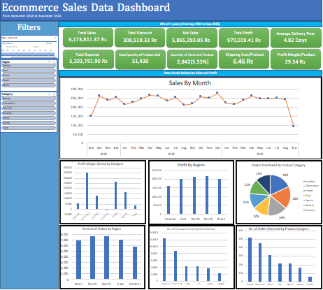

# E-commerce Sales Data Cleaning & Dashboard

## Project Overview

This project focuses on preparing and analyzing a large e-commerce sales dataset and presenting the results through structured analysis reports and an interactive Excel dashboard.

The original dataset contains **34,500 sales records** covering information about orders, customers, products, pricing, discounts, payment methods, dates, delivery times, regions, returns, sales amounts, shipping costs, profit margins, and customer demographics.

The project combines data preparation, structured organization, exploratory analysis, profitability analysis, regional analysis, and dashboard reporting.

---

## Objective

The main objectives of this project were to:

- Inspect and prepare a large sales dataset for analysis.
- Clean and organize the dataset into structured tables.
- Validate and standardize important fields.
- Perform exploratory data analysis.
- Analyze profitability across product categories.
- Analyze sales and profitability across regions.
- Identify patterns in order distribution.
- Create a dashboard containing key sales and profitability KPIs.
- Present the analysis in a business-friendly format.

---

## Dataset Overview

> **Note:** The records are synthetic and are used for portfolio and learning purposes.

The original dataset contains **34,500 records** and 17 fields.

Key fields include:

- Order ID
- Customer ID
- Product ID
- Category
- Price
- Discount
- Quantity
- Payment Method
- Order Date
- Delivery Time
- Region
- Returned
- Total Amount
- Shipping Cost
- Profit Margin
- Customer Age
- Customer Gender

The data covers multiple product categories, regions, payment methods, and customer attributes.

---

## Data Preparation

The original sales data was reorganized into structured sections to make it easier to work with and analyze.

The cleaned workbook contains structured tables for:

- Order information
- Product information
- Customer information
- Order ID lookup/finder functionality

The cleaned dataset was also formatted and prepared for analysis and reporting.

---

## Exploratory Data Analysis

Exploratory analysis was performed to understand the distribution of orders, profitability, regions, categories, and payment methods.

The analysis includes:

- Orders by product category
- Profitability by product category
- Profitability by region
- Order distribution by region
- Payment-method analysis
- Product-category distribution by region

---

## Key Findings

### Order Distribution by Category

The dataset contains 34,500 orders.

The largest order categories were:

| Category | Orders |
|---|---:|
| Fashion | 6,254 |
| Electronics | 6,180 |
| Home | 5,487 |
| Toys | 4,247 |
| Sports | 4,171 |
| Beauty | 4,103 |
| Grocery | 4,058 |

Fashion had the highest number of orders in the dataset.

---

## Profitability Analysis

Total profit margin across the dataset was approximately:

**970,019.41**

Electronics was the most profitable category based on total profit margin, while Grocery produced a negative total profit margin in the analysis.

| Category | Total Profit Margin |
|---|---:|
| Electronics | 344,371.77 |
| Home | 262,633.70 |
| Sports | 160,521.41 |
| Fashion | 128,814.65 |
| Beauty | 49,196.59 |
| Toys | 33,669.25 |
| Grocery | -9,187.96 |

These results demonstrate why order volume alone does not necessarily indicate profitability.

---

## Regional Analysis

The analysis evaluated both order volume and profitability by region.

Profit margin distribution was:

| Region | Profit Margin Share |
|---|---:|
| South | 21.76% |
| North | 21.49% |
| West | 20.35% |
| East | 20.11% |
| Central | 16.29% |

South had the highest share of total profit margin among the five regions.

---

## Dashboard

An Excel dashboard was created to provide a consolidated view of the sales data.

The dashboard includes KPIs and visualizations covering:

- Total Sales
- Total Discount
- Net Sales
- Total Profit
- Average Delivery Time
- Quantity Sold
- Quantity Purchased
- Shipping Cost per Product
- Profit Margin per Product
- Sales by Month
- Profit Margin by Category
- Profit by Region
- Order Distribution by Category
- Orders by Region
- Payment Method Analysis
- Returned Orders by Category

The dashboard includes slicers and a timeline for interactive filtering and exploration of the dataset.

---

## Dashboard Preview



---

## Key Data Analysis Skills Demonstrated

- Data cleaning
- Data organization
- Data validation
- Exploratory Data Analysis
- KPI development
- Profitability analysis
- Regional analysis
- Category analysis
- Pivot-based analysis
- Dashboard reporting
- Exploratory Data Analysis
- Business-oriented data presentation

---

## Tools Used

- Microsoft Excel
- Excel Tables
- Pivot Tables / Pivot-based analysis
- Excel Slicers
- Timeline
- Excel Dashboard
- Data Cleaning and Validation

---

## Repository Structure

```text
Ecommerce-Sales-Data-Dashboard/
│
├── README.md
│
├── Data/
│   ├── ecommerce_sales_data_raw.xlsx
│   └── ecommerce_sales_data_cleaned.xlsx
│
├── Dashboard/
│   ├── sales_dashboard.xlsx
│   └── sales_dashboard.pdf
│
├── Reports/
│   ├── exploratory_data_analysis.xlsx
│   ├── profitability_data_analysis.xlsx
│   └── regional_data_analysis.xlsx
│
├── Screenshots/
│   ├── sales_data_dashboard.png
│   ├── eda_of_sales_data_overview.png
│   ├── profitability_data_analysis_overview.png
│   └── regional_data_analysis_overview.png
│
└── documentation.md

```